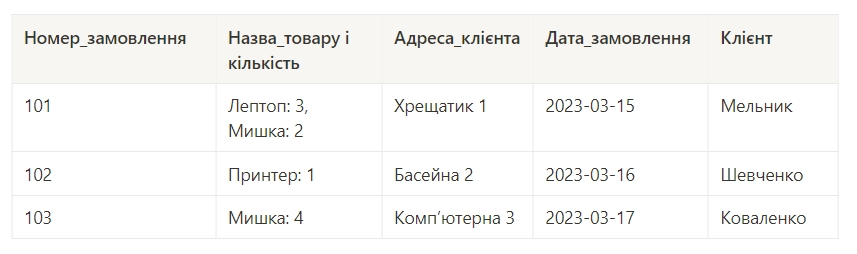
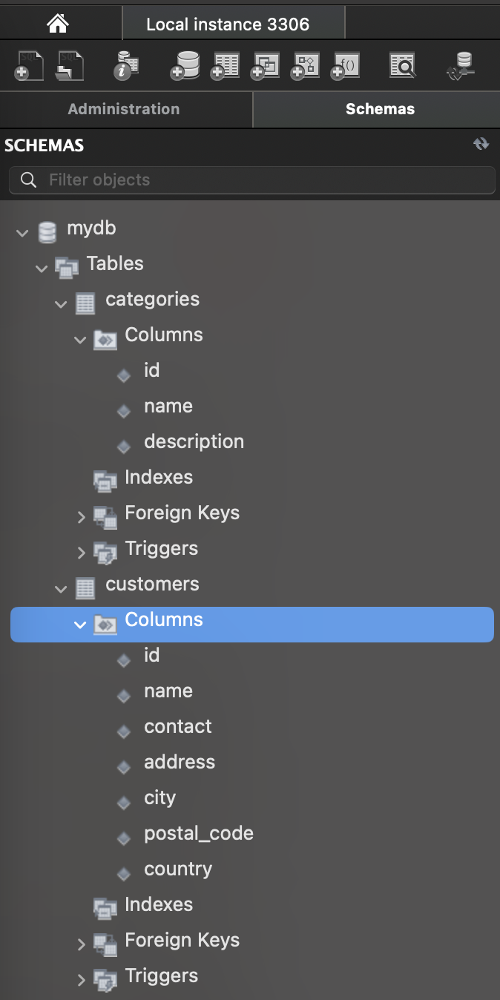
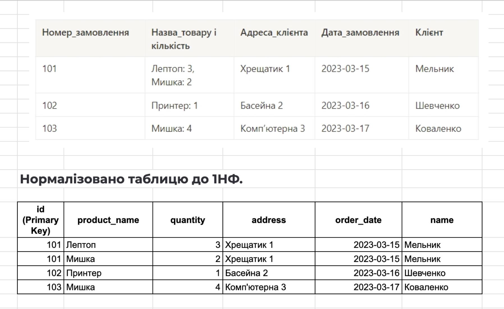
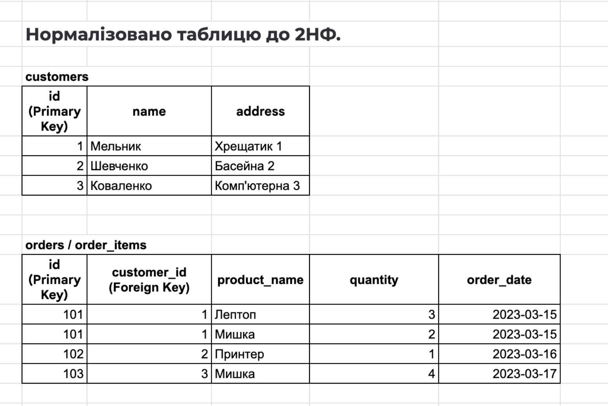
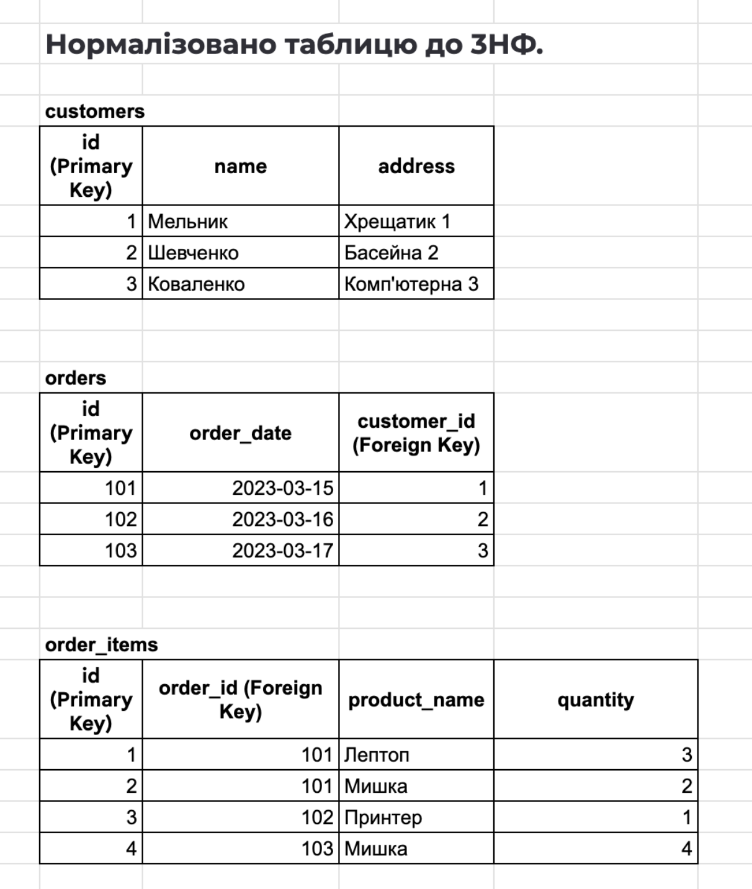
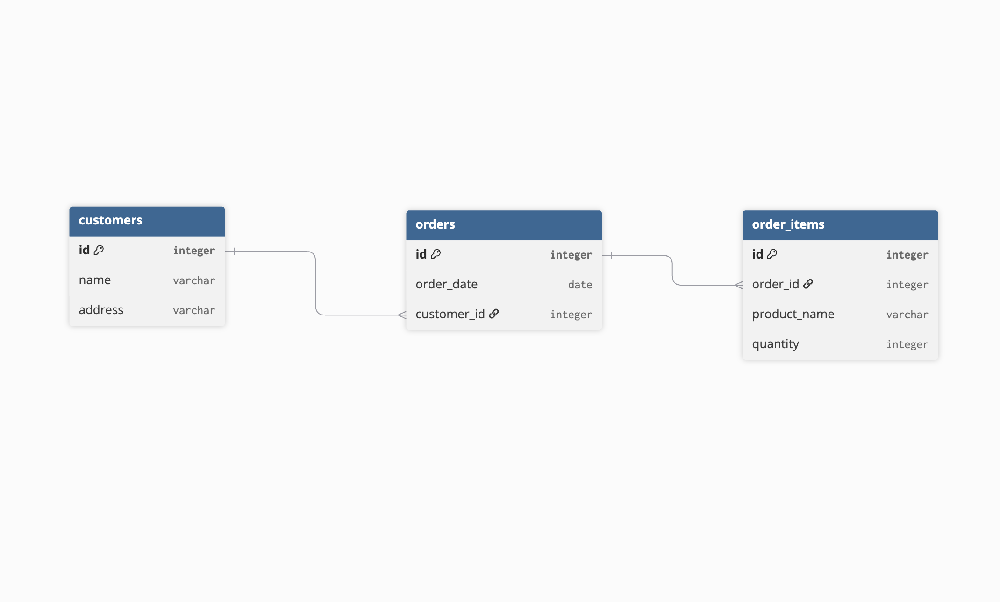
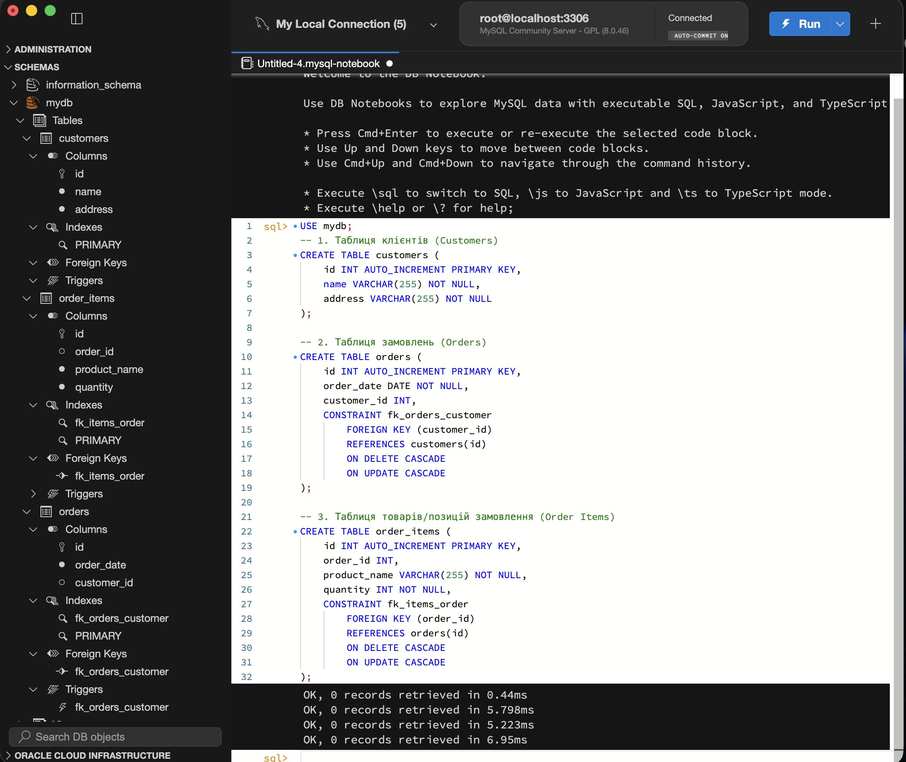

# Домашнє завдання до Теми 2. Проектування баз даних з використанням семантичних моделей

#### Вам потрібно буде:

• перевести таблицю до такого стану, щоб вона відповідала вимогам першої, другої та третьої нормальної форм;

• створити ER-діаграму, що відображає взаємозв'язки між сутностями;

• створити таблиці в базі даних на основі ER-діаграми.

#### Це завдання допоможе вам:

• Опанувати техніку переведення даних у нормалізовану форму для забезпечення їхньої ефективності та послідовності.

• Зрозуміти, як визначати й моделювати сутності та їхні взаємозв'язки, що є важливим для правильної організації інформації в базі даних.

### Підготовка та завантаження домашнього завдання

1. Створіть публічний репозиторій `goit-rdb-hw-02`.
2. Виконайте завдання та відправте скриншоти таблиць, файл і/або скриншот ER-діаграми та скриншот розгорнутої схеми у Workbench у свій репозиторій.
3. Завантажте перелічені скриншоти на свій комп’ютер та прикріпіть їх в LMS архівом. Назва архіву повинна бути у форматі ДЗ2_ПІБ.
4. Прикріпіть посилання на репозиторій `goit-rdb-hw-02` та відправте на перевірку.

### Формат здачі

• Прикріплені файли репозиторію архівом із назвою ДЗ2_ПІБ.

• Посилання на репозиторій.

## Опис домашнього завдання

1. Переведіть початкову таблицю в першу нормальну форму.

2. Переведіть нові таблиці в другу нормальну форму.

3. Переведіть нові таблиці в третю нормальну форму.

4. Розробіть ER-діаграму отриманих таблиць.

- 💡 Використовуйте зрозумілі та конкретні імена для сутностей та атрибутів. Уточнюйте типи даних для атрибутів. Перевірте, чи всі відношення й атрибути мають чіткі і зрозумілі кардинальності та значення.

5. Використовуючи ER-діаграму, створіть таблиці в базі даних. Оформте ці таблиці без конкретних значень, тільки з урахуванням колонок та їхніх зв'язків, вручну або автоматично.

#### Початкова таблиця

## Критерії прийняття

1. Прикріплені посилання на репозиторій `goit-rdb-hw-02` та безпосередньо самі файли репозиторію архівом.

2. Нормалізовано таблицю до 1НФ.

3. Нормалізовано таблицю до 2НФ.

4. Нормалізовано таблицю до 3НФ.

- 💡 Результат нормалізації таблиць може бути в довільній формі/форматі (Google Doc, Google таблиці тощо).

5. Створено ER-діаграму отриманих таблиць. Діаграма має відповідати нормалізованим таблицям.

- 💡 Має бути декілька таблиць зі зв’язком між ними. Результат може бути у вигляді файлу та/або скриншота.

6. Використано зрозумілі та конкретні імена для сутностей та атрибутів. Уточнено типи даних для атрибутів. Усі відношення й атрибути мають чіткі і зрозумілі кардинальності та значення.

7. Створено таблиці в базі даних (тільки таблиці й колонки з урахуванням зв'язків) вручну або автоматично.

- 💡 Результат має бути у вигляді скриншота розгорнутої схеми у Workbench.

#### Результат виконаного ДЗ

## Нормалізовано таблицю до 1НФ:

## Нормалізовано таблицю до 2НФ:

## Нормалізовано таблицю до 3НФ:

## Створено ER-діаграму отриманих таблиць (https://dbdiagram.io/):

## Створено таблиці в базі даних:

